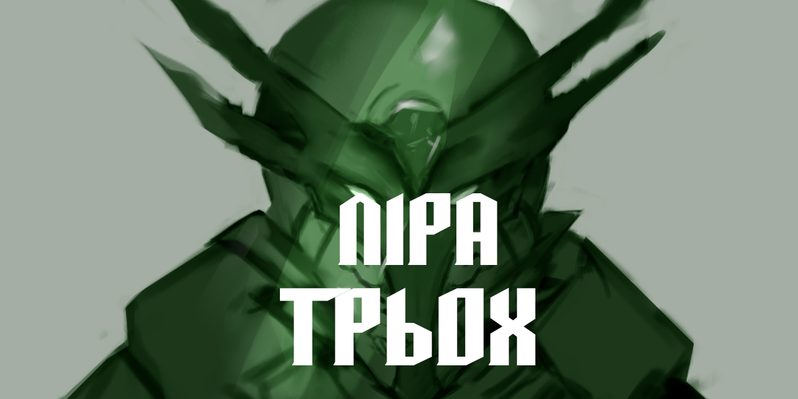

# Ліра Трьох

В цьому репозиторії зібрано всі опубліковані на сьогодні розділи книги "Ліра Трьох" авторства Нікіти Філімонова (aka Семен). Також тут зібрано додаткові авторські матеріали (хронології подій сетингу, ілюстрації) та неканонічні фанфіки.

Усі текстові файли подано в форматі Markdown, з відповідним застосованим форматуванням.

## Навігація

### Ліра Трьох
* [Розділ 1 — Морозне обличчя надії та війни](chapter_1.md)
* [Розділ 2 — Ще невідоме deja vu або Погоня за круком — Частина 1](chapter_2.md)
* [Розділ 3 — Ще невідоме deja vu або Погоня за круком — Частина 2](chapter_3.md)
* [Розділ 4 — Суцільні роздуми](chapter_4.md)
* [Розділ 5 — Пригоди тільки починаються](chapter_5.md)
* [Розділ 6 — Душа взамін на розум](chapter_6.md)
* [Розділ 7 — Парламентер та Дикуни](chapter_7.md)
* [Розділ 8 — Фіалки на початку березня](chapter_8.md)
* [Розділ 9 — Вітер розвертається не до сторони добра](chapter_9.md)
    * [Додатковий мінірозділ — І лебідь був оповитий лозою](chapter_9.5.md)
* [Розділ 10 — І засяє Ліра весняним цвітом](chapter_10.md)
* [Розділ 11 — Крізь нетрі до справедливості](chapter_11.md)

### [Фотоальбом](PICTURES.md)

### Додаткові матеріали
* [Короткий переказ "Ліри Трьох" від Bypip'а](summary__by_Bypip.md)
* [Короткий переказ двох майбутніх книг від Вітриля](future_books__summary__by_Veetrill.md) (написано за [стенограмою](future_books__transcript__by_Veetrill.md))
* [Історія Сарадинського султанату](bonus_content/sultanate.md)
* [Хронологія Врадазу](bonus_content/vradaz_chronology.md)
* [Хронологія Разінару](bonus_content/world_chronology.md)

### Неканонічні твори (фанфіки)
* Фанфіки Вітриля:
    * [Казка про Павича](fan_fiction/peacock__by_Veetrill.md)
    * [Приквел про Влада](fan_fiction/vlad__by_Veetrill.md)
    * [Байка Басаньйо про ~~мадж~~ кажіджонг](fan_fiction/kajijong__by_Veetrill.md)
      * [Леорій та чужоземці Gaiden](fan_fiction/gaiden__by_Veetrill.md)
* Фанфіки gash0sh'а:
    * [Гітара восьми (незакінчений)](fan_fiction/guitar__by_gash0sh.md)