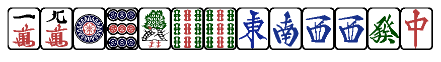
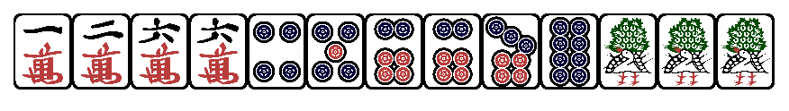

[//]: # (Фанфік було написано після релізу сьомого розділу ЛТ.)

Цей день стане для молодого Басаньйо незабутнім. Його нога вперше ступила до зали, про яку раніше він чув тільки байки — закритий ігорний дім в Сарджанійському замку морів, доступний виключно для осіб з закритого кола. Будучи недопущеним до "білого списку", він ніколи б навіть не мріяв сюди потрапити, якби за нього не замовив слово один багатий вельможа в знак подяки за врятоване життя.

За своє коротке, але насичене життя Басаньйо встиг надивитись на найрізноманітніші красоти з різних куточків королівства. Але ніщо з побаченого не йшло в порівняння з тією розкішшю, яка відкрилась перед ним тут. Яскраві та елегантні прикраси на стінах та стелі, шикарно виткані килими на підлозі, не менш вичурно оформлені столи та стільці і незчисленна кількість багатіїв, що сидять за цими столами, вирядившись за останнім писком аристократичної моди. Всі прийшли сюди заради програвання своїх статків. Окремі щасливчики вряди-годи можуть винести більше грошей, ніж принесли, але більшість все ж йтиме додому з дірою в кишені та збоченним задоволенням в голові.

Будучи в бігах після розкритої любовної інтриги з донькою лорда Новака, Басаньйо не мав ні копійки за душею і не знав куди податись. Цього вечора він сам був би радий забутись та пірнути з головою в азартні ігри, але одна біда — на все про все в нього була одна золота монета, і ту він носив з собою суто на удачу. Тож він просто ходив і пасивно спостерігав за тим, що відбувається на різних столах. Одні грали в знайомі йому як облуплені нарди, другі грали в різні карткові ігри, треті крутили колесо фортуни та
робили ставки.

Аж раптом він помітив щось незвичне. В непомітному кутку зали стояв стіл, який дещо вибивався з гармонійного пейзажу. За цим столом сидів молодик благородної і чимось до болю знайомої зовнішності. Ліворуч та праворуч від нього були слуги з розкосими очима — ще ніколи Басаньйо не бачив таких людей, та навіть не знав, що такі існують. Також за столом був один незайнятий стілець.

Те, що було на столі, увагу приковувало не менше — незрозумілі на вигляд плитки, чимось схожі на гральні карти, але більш об'ємні та моцні на вигляд. Басаньйо вже почав уявляти, які вони могли б бути на дотик.

Аристократичний молодик, побачивши зосереджений погляд Басаньйо, став зі столу та махнув рукою.

**Леорій:** Бачу, тобі цікаво, чоловіче. Ну, не стій, як бідний родич, ходи до нас!

Сумнівів ніяких, це був принц Леорій з роду Лійонорів власною персоною. Яким дивом його занесло аж до Сарджанийського замку морів? Що за цікаві люди поряд з ним? І що це за гру він затіяв? Бажання з'ясувати відповіді на ці питання перебороли усіляку сором'язливість і Басаньйо попрямував до них.

**Басаньйо:** Доброго вечора вашому столу. А що це за така гра у вас?

**Леорій:** Вперше бачиш, ге? Воно й не дивно, в нас цю гру мало хто знає. Кажіджонг, заморська екзотика.

**Басаньйо:** Клас… А дозвольте поцікавитись, ви чекаєте на четвертого гравця?

**Леорій:** Чекаємо на того, хто відважиться спробувати нову для себе річ. Можливо, це будеш ти?

**Басаньйо:** Якби ж я тільки правила знав.

Леорій все зрозумів. Треба тягнути рибу, поки клює.

**Леорій:** Не бійся, правилам навчимо. Якщо тільки погодишся грати.

**Басаньйо:** Та я… і грошей якось не сильно маю.

**Леорій:** Про це теж не переймайся. Ти ж знаєш, хто я такий?

**Басаньйо:** Звичайно, Ваша Високосте.

**Леорій:** Ну от. Фішки всім гравцям видамо однаково. Хто програється, той потім платить. Якщо виграєш — можеш не сумніватись, грошами не обділю. Якщо програєшся — теж можеш не сумніватись, що дістану з-під землі та струшу все до останньої монети.

Басаньйо задумався. Все це виглядало надто нечисто, та й влазити в борги перед наслідним принцем йому не хотілось.

Та з іншого боку, коли ж ще випаде можливість пограти в азартну гру з майбутнім королем Хейдендалю, як не зараз? Багато хто з жителів королівства про таке й мріяти не сміє.

Пан або пропав! Треба спробувати!

**Леорій:** Ну то чого залип, вуйку? Будеш грати? Чи сциш?

**Басаньйо:** Згода, Ваша Високосте! Розставляйте!

Леорій все зрозумів і кивнув.

**Леорій:** Вже все розставлено. Ти сідай і слухай правила уважно, повторювати вдруге не стану.

Як для нащадка престолу, що мав би бути навченим ораторському ремеслу, Леорій
досить непевно і недбало викладав матеріал. Його слуги робили вигляд, що задають уточнюючі запитання, і таким чином ненав'язливо його поправляли. Акцент слуг виявився ще більш кумедним та незвичним, ніж їхня зовнішність, але Басаньйо все ж так і не наважився спитати, звідки це принц їх відкопав. Сам принц не вважав за потрібне представляти гравців одне одному, тож Басаньйо відокремив цих двох слуг для себе як “Товстого” (по ліву руку від Леорія) та “Писклявого” (по праву руку від Леорія). І хоч матеріал правил виявився вельми непростим для засвоєння, Басаньйо вже було не звикати діяти по ситуації та швидко адаптуватись до нових умов. Він був готовий.

---

Перша партія східного раунду, на Сході Леорій.

Для початку Басаньйо мав глянути на свої тринадцять плиток та оцінити, скільки чого він має і які потенційні яку він може з цього зібрати. І тільки-но в його голові почали промальовуватись якісь патерни, як раптом…

**Леорій:** Цумо! Тенхо!

Плитки на руках Леорія впали на стіл, показуючи всім готову зібрану комбінацію. Якуман на Сході.

**Леорій:** Прошу, шановні, по 16 тисяч з кожного!

Басаньйо вловив з пояснень, що існує рідкісна можливість зібрати так званий якуман тенхо — одразу готову виграшну комбінацію на першому ж ходу. Та навіть йому було зрозуміло, наскільки малим є шанс з усіх 136 плиток підібрати сходу 14 саме таких, що зійдуться воєдино. Невже саме так виглядає королівська вдача?

Втім, щось перечити тут пізно, пора грати далі. Плитки було перемішано та роздано, хоча б другого разу таке повторитись вже не має.

---

Перша повторна партія східного раунду, на Сході все ще Леорій.

Відсортувавши плитки на своїй руці, Басаньйо побачив наступне:

Не знаючи, в який бік розвивати комбінацію, Басаньйо вирішив схилитись до хоніцу. Та вже на півдорозі партії йому довелось пошкодувати про це рішення — всі інші гравці розкусили його наміри і, неначе змовившись, перестали скидати плитки масті со геть зовсім.

Знов незрозуміло, що коїться? Це якась змова? Звичайно, з його відбоїв і без усіляких змов можна здогадатись, що раз він скидає тільки піни та мани, то явно збирає со. Але ж чому і Леорій, і його слуги весь час показують одне одному якісь кумедні жести?

Партія закінчилась нічиєю. Басаньйо навіть не спромігся вийти в темпай і був змушений заплатити 1000 очок.

---

Друга партія східного раунду, на Сході Писклявий.

Рука Басаньйо знову дозволяла гнучкі маневри.

З одного боку, він міг би швидко відкритись та вийти на якухай. З іншого боку, втім, бажання виграти з таньяо на закритій руці пересилило.

З десяток ходів потому Басаньйо вигукнув:

**Басаньйо:** Річі!

Його темпай виглядав гарно і обнадійливо:

Леорій все зрозумів та знущально усміхнувся. Як і його слуги.

Тепер, більше не маючи контролю над власною рукою, Басаньйо більше зосередився на їхній мові жестів. Невдовзі йому стало ясно, що вони навіть не спроможні щось показувати приховано чи зашифровано, всі їхні переговорні маневри легко розгадуються після кількох хвилин спостереження. Виглядало це як дешевий спектакль, навіть діти з початкової школи зобразили б щось більш таємниче.

Тим не менш, попри всю "палевність", свою функцію ці жести виконували — Леорію оперативно повідомлялось про те, які плитки скидати не слід. Саме тому Басаньйо спромігся виграти лиш через цумо. Це був таньяо, іпейко, мензен цумо та річі. Досить непогано для того, щоб потроху відігруватись… було би, якби в останню мить Басаньйо не згадав про розкриття урадор з "мертвої стіни", з яких йому пощастило урвати ще додаткові 3 хан, піднявши таким чином вартість руки до ханеман.

Леорій все зрозумів. Вигляд в нього був похмурий.

---

Третя партія східного раунду, на Сході Басаньйо.

З оживлених жестів та рухів суперників Басаньйо вловив, що вони щось замислили.  
Вже незабаром він побачив оголошення річі від усіх трьох. Але як це так? Невже їм аж настільки щастить?

Все, що Басаньйо тепер хотів — це вижити і не підставитись. Однак, поволі маневруючи, він якимось дивом спромігся зібрати темпай сам. Зі спортивного інтересу побачити, що станеться далі, він вигукнув:

**Басаньйо:** Річі!

Слуги Леорія на мить підвисли.

**Товстий:** Нані?

**Писклявий:** Це нітія!

Леорій не зрозумів.

**Леорій:** Яка ще нічия? Граємо далі.

**Писклявий:** Суутя рііті! Не модзіна! Нітія!

**Леорій:** Що ти верзеш?

**Писклявий:** Чотирі разі охоросєно річі! Це нітія!

**Леорій:** Та хоч і десять разів, йобтарарай! Це заважає нам грати?

**Товстий:** Демо… бі хотіри хіраци з нічією, щіобі бі разі чьохо почаци нанобо?

Леорій все зрозумів.

**Леорій:** Для "9 сиріт" нічию лишаємо. Але ніякої перероздачі на чотирьох річі. Граємо далі.

Тепер ніхто за столом не знав, хто може виграти. По виразу обличь слуг було видно їхнє невдоволення ситуацією, що склалась.

Ця партія закінчилась нічиєю. Всі поставлені тисячі лишились на столі.

---

Перша повторна партія східного раунду, на Сході все ще Басаньйо.

Відкривши свою руку, Басаньйо зморщився.

8 сиріт. Максимально несумісні циферні плитки. Все виглядало так, наче йому навмисно підтасували руку, щоб той тепер вже точно не зміг виграти.

Вирішивши рухатись за течією та дивитись, що буде далі, Басаньйо пішов в повну оборону. Сидіти там довелось недовго — ще в середині партії Товстий оголосив виграш. Через рон. З відбою Писклявого.

Здавалось би, для Леорія цей маневр абсолютно нічого не дає, адже не збільшує його очок, як і не забирає очок в Басаньйо. Вочевидь, намір був лиш в тому, щоб позбавити Басаньйо пригрітого місця на Сході.

---

Четверта партія східного раунду, на Сході Товстий.

Ось, що цього разу побачив Басаньйо:

11 сиріт. Здавалось би, пряма дорога до якуману кокуші мусо. Проте, Басаньйо вмить розкусив цю явно підтасовану для нього пастку — а тому замість цього вирішив ввімкнути дурня й прикинутись, що збирає таньяо.

Крайні та благородні плитки у відбій він складав акуратно, мавпуючи чужі відбої. Слуги щось бурчали незрозумілою говіркою під ніс незадоволеним тоном.

Партія закінчилась нічиєю. Кожен з гравців показав темпай. Кожен, окрім Басаньйо.

**Товстий:** Руку показуй, бака! Або давай трі тишячі!

**Басаньйо:** Та воно-то так, панове, але гляньте на мої відбої.

**Товстий:** Нандайо!

**Писклявий:** Наґасі манґан!

Леорій не зрозумів.

**Леорій:** Каво?

**Писклявий:** Наґасі манґан! Усі бідубої зі кіраніхь та бурагородуніхь!

**Леорій:** А? Таке реально є?

**Товстий:** Хай! Це пурописано у переріку яку!

Леорій все зрозумів, подивившись на список. Не обманули, цей яку там дійсно був.

Принц сам ледь-ледь пам'ятав всі правила. Привізши кажіджонг та двох чужоземців до Хейдендалю, він хотів швидко порубати грошви з наївних гравців казино, але для цього він був змушений сам ще не один тиждень займатись факультативно зі своїминапарниками, поки ті втовкмачували йому очевидні по грі речі. Не дивно, що таку річ, як наґаші манґан, той просто-напросто забув, якщо сам ледь дивиться у те, що коїться у відбоях.

Це був кінець східного раунду. З 25 тисяч початкових очок Басаньйо ледь-ледь утримав 10. Втім, на обличчі Леорія читалась легка роздратованість, бо навіть такий хід гри він вважав неприпустимо довгим.

Раптом до Леорія підійшов лакей та щось шепнув на вухо. Тоді принц піднявся з-за столу і сказав:

**Леорій:** Я мушу відійти в справах. Зробимо перерву перед наступним раундом. Юначе, сходи-но в бар та хильни чогось, розвійся.

**Басаньйо:** Та мені й тут нормально, дякую. Та й грошей нема…

**Леорій:** Йди. Скажи бармену, що ти від мене, він питань не задаватиме.

Розуміючи, що відповідь «ні» тут не приймуть, Басаньйо став і пішов. Писклявий кинув йому вслід:

**Писклявий:** Кори сінно кадзе іди, то ти маєсь сурухатись і биконубати йохо болю, бака!

**Басаньйо:** Він і без тебе все зрозумів, довбню. І скільки я разів тобі казав, не називай мене "шінно"!

**Писклявий:** Сумімасе, Реорі-сама.

**Леорій:** Робіть все, як ми домовлялись.

**Писклявий:** Хай!

**Товстий:** Хай!

---

Бар в ігорному домі був співрозмірно розкішним самому ігорному дому, на полицях стояли сотні різних напоїв з усіх куточків Врадазу. Але змучений як павич Басаньйо вже навіть не кинув оком на цей натюрморт, а просто всівся за стійку та звернувся до бармена:

**Басаньйо:** Слава Хейдендалю. Наллєте мені півлітри пшеничного? Я від…

**Бармен:** …принца Леорія, і все за його рахунок. Знаю. Тримай.

Басаньйо зробив ковток. В його голові все ще вирувала купа думок і він намагався бодай якось зосередитись.

**Бармен:** Ти вже далеко не перший, хто на це попався. Думаєш, ця мажорна паскуда прийшла сюди грати по-чесному?

**Басаньйо:** Ви про що се?

**Бармен:** Про вашу гру в оцей "кажіжонг".

Як завжди, в таких напружених розмовах Басаньйо вже на автоматі ввімкнув наївного дурника.

**Басаньйо:**  Йой, а шо таке? Мене обманюють? Мені не так правила розповіли?

**Бармен:** Ти ідіот чи придурюєшся? Ти не бачиш, як вони постійно перемовляються, кому як що підтасувати? Ти не второпав, що оцей "техас" на старті був не випадковий? І що ще один такий "техас" ти побачиш і знов, як прийдеш до них і сядеш за стіл знов? Серйозно, я в шоці з того, що ти там досі не влетів в мінуси.

**Басаньйо:** То принц Леорій мухлює і обманює, так ви кажете? Вам оце не встидно так наговорювати на наш королівський рід?

Бармен зітхнув.

**Бармен:** Я вірний підданий нашого короля і готовий життя за нього покласти, але оцей його принц… той ще фрукт. Він має всі гроші на світі, та попри це все одно преться й претьсясюди зі своїм столом та двома косоокими, щоб саджати людей за оцей "кажіжонг" та видурювати в них гроші, заганяючи їх в зубожіння. Мабуть, йому подобається змушувати когось страждати.

**Басаньйо:**  То ви таки хочете сказати, що я не виграю?

**Бармен:** Я тобі хочу сказати от що. Зазвичай це Леорій змушує всіх вмирати від страху і зливатись ще в перші півгодини. Ти ж його вивів з рівноваги сам — це вже багато чого вартує. А зараз він ще й змушений був відволіктись на якийсь важливий дзвінок зі столиці. В тебе є вікно часу. Тож моя тобі порада — тікай звідси, поки живий та цілий.

**Басаньйо:**  А що за дзвінок там? Папа хвилюється, куди то золота молодь гроші з казни спуска?

Бармен сперся обома руками на барну стійку і пильно поглянув на Басаньйо.

**Бармен:** Слухай, салаго, ти хоч розумієш, в якій сраці опинився? Я з тобою жарти не жартую, допивай пиво та зйобуй. Залягай на дно. Молись усім богам, щоб гінці Леорія тебе не знайшли. Він деякий час побіситься й вспокоїться, поки не знайде собі нову жертву. Можливо, він навіть не згадає про тебе потім.

**Басаньйо:**  Ні, дядьку, стривайте, що там ви казали про цей дзвінок? Там все серйозно? Він надовго відійшов?

**Бармен:** Не знаю. Він був дуже сердитий, що "має балакати з цим гнидником з академії". Насправді мені по цимбалах, з ким там і про що він говорить, я хвилююсь більше за тебе.

Краєм ока Басаньйо побачив двох краль, що нудьгували неподалік. В його голові з'явився план.

**Басаньйо:**  Дякую за напій, бармене. Запишіть на рахунок принца 200% чайових. І налийте-но мені ще два коктейлі, будь ласка.

Бармен всміхнувся.

**Бармен:** А ти зухвалий. Ну, роби як знаєш. Мені аж самому тепер цікаво, чим це все скінчиться.  

Допивши пиво, Басаньйо взяв по бокалу в кожну руку та, імітуючи кумедну ходу одного пірата з Баярду, підвалив до краль зі словами:

**Басаньйо:** Чарівні принцеси, як це так, що ви обділені увагою в цей прекрасний вечір? Не бажаєте пригоститись коктейлями?

**Краля:** Ой, як мило. Ми сидимо в очікуванні чарівних принців. Можливо, ви нам розкажете, де їх носить?

**Басаньйо:** Не просто розкажу, а й проведу вас до двох впливових заморських панів, наближених до монаршої особи. Ви ж знаєте про Леорія з роду Лійонорів?

Жіночки перезирнулись з неабияким захопленням.

**Краля:** Дуже цікаво! Ведіть нас!

Повернувшись до ігрового столу, Басаньйо застав там двох слуг. Леорія не було.

**Басаньйо:** Самураї, а де ж Його Високість?  

**Товстий:** Бу ніохо важурибі перемобини. Раунду безу ніохо не почінемо, сідай та чекай.

**Басаньйо:** Так, так, звичайно. І дозвольте мені тим часом представити вам двох прекрасних дам. Це Анна, це Ельза.

Задум пройшов як по маслу. Жіночки мали вельми дивакувату зовнішність, яка не вдовольнила б розбещеного принца — але його слуги, явно більш обділені жіночою ласкою, були цілком раді пофліртувати з дівчатами, до яких вони б ніколи не наважились підійти самостійно.

---

**Леорій:** ТАК! Що це тут за бордель?!

Леорій стрімко понісся до столу, неначе забувши про королівську грацію. Його
обличчя було червоним від люті.

**Басаньйо:** А, Ваша Високосте. А ми оце чекаємо на вас, та от тут вирішили провести час в компанії дам…

**Леорій:** Я вам дам "дам"! Так, ляді, а ну котіться геть від королівського столу. Продовжимо нашу гру.

Перша партія південного раунду, на Сході Леорій.

Басаньйо неквапливо сортував свої плитки, знаючи, що тепер матиме достатньо часу.

Леорій не зрозумів. Він цілу хвилину задумливо дивився на свою руку. Не так-то просто оголосити "тенхо", коли одна з плиток на руці не вписується в комбінацію — та сама плитка, яку Басаньйо непомітно підмінив, провівши відволікальну операцію.

**Басаньйо:** Ваша Високосте, ваш хід. Будете ходити?

Леорій все зрозумів.

**Леорій:** Та їбися ти конем! Дабуру річі!!!

Основна загроза минула, але розслаблятись було ще рано. Тепер перед Басаньйо була ціла партія з ходів, які слід було робити обережно, щоб не "підставитись".

Хід за ходом слуги робили непевні жести, явно натякаючи принцу на те, щоб
"скормити" йому виграшну плитку, але той відмовлявся.

В цій партії не виграв ніхто. Всі, окрім Леорія, мали ноутен. Тисяча очок — це не така вже й велика ціна, порівняно з тим, що могло би статись.

---

Перша повторна партія південного раунду, на Сході все ще Леорій.

Цього разу розклад для Басаньйо був більш однозначним.

Не минуло й десяти ходів, як він вже мав темпай на чітойцу. Але річі оголошувати не став — проти таких гравців це вкрай небезпечно.

Знову нічия. Темпай в Басаньйо та Леорія.

Леорій все зрозумів. Йому сподобалась ідея сидіти на Сході якнайдовше, щоб потім вгатити по Басаньйо накопиченими хонбами.

---

Друга повторна партія південного раунду, на Сході все ще Леорій.

Недовго минуло часу, як принц вигукнув:

**Леорій:** Річі!

Басаньйо поглянув на свою руку:

Це темпай. Оголосити річі? Все ще безглузда ідея — ніхто з присутніх за столом не став би йому "підставлятись". Та й навіть так, на цю мить 3-ман — єдина плитка, з якою він може виграти, — вже повністю лежить у відбоях. Ситуація безвиграшна. Тим не менш…

**Басаньйо:** Річі!

Леорій все зрозумів. Він просвердлив Басаньйо кровожерливим поглядом — подібним до того, як мисливець дивився б на загнану в кут жертву.

В будь-яку мить ця авантюра могла б обірватись, якби тільки хтось зі слуг підкинув Леорію виграшну плитку. Та тепер Леорія не цікавило більш ніщо на світі окрім прямого виграшу над Басаньйо.
Нічия. Темпай в Басаньйо, Леорія та Писклявого. Басаньйо нічого не набув і не втратив в цій партії, та його задум набирав обертів. Принц виявився жадібним та падким до нарощення виграшу, і залишені на столі зайві тисячні фішки лиш підігрівали його інтерес.

---

Схожим чином минуло ще чотири партії. Басаньйо умудрився ні разу не програти, але ще пару разів докласти до виграшного пулу по тисячі очок, оголошуючи річі. Втім, де в яких з нічиїх він не відігравав втрачені тисячі, а десь і геть втрачав очки, будучи в ноутені.

Ситуація Басаньйо поволі переросла в критичну — всього лиш 500 очок в запасі.
Оголошення ріічі більше неможливе, і будь-який чужий виграш (навіть через цумо) загрожує остаточною поразкою.  
Та Басаньйо не переймався думками про свій спустошений рахунок. Його увагу
приковував Леорій, який, бачачи люту кількість очок у виграшному пулі, мав нестримне бажання видовищно, по-королівськи добити свою жертву. Це робило його самого вразливим як ніколи.  

---

Сьома повторна партія південного раунду, на Сході все ще Леорій.

Басаньйо поглянув на свою руку та ледь стримав подив:

Як би слуги принца спритно не підтасовували плитки в стінах, вони не мали влади над тим, щоб передбачити хід гри від початку до кінця.

Разом з тим, Басаньйо усвідомлював, що простий шьосуушіі ситуацію не переломить, треба діяти більш зухвало. Зараз або ніколи.  

Середина партії. Басаньйо отримав південь з роздачі та зробив закритий кан. Леорій вже тричі вигукнув "пон", зібравши тріади одиниць з усіх трьох мастей. Це загострило увагу Басаньйо на тому факті, що ніхто, окрім нього, не скидає крайніх цифер. І це дало йому ідею.  

Вмить як Товстий скинув захід, Басаньйо без задньої думки вигукнув:

**Басаньйо:** Кан!

По-королівськи піднявши брову, Леорій дав Товстому знак викинути й південь теж.

**Басаньйо:** Кан!

Леорій все зрозумів. Він ні за що не дозволить смерду зіпсувати свій грандіозний план розправи.  

Він пишався з себе від того, який хитрий план-капкан придумав — якщо йому й не дістанеться виграш з чінрото і його суперник виграє раніше з шьосуушіі, то Писклявий підпаде під правило секінін барай і таким чином прийме весь удар на себе. Тому далі за його командою вже Писклявий скинув схід.

…Але Басаньйо на цю провокацію не повівся. Від самого початку він міг ховати тріади вітрів та зібрати шьосуушіі неочікувано — але він не став цього робити. Він знав, що єдиним способом вийти звідси живим є прицільний удар по леву, який не зачіпатиме сусідніх шакалів.

Тим не менш, з кожним вигуком кількість рухомих плиток на руці ставала все меншою. І тепер Басаньйо стояв на краю прірви.

Басаньйо знав, що, викинувши схід, він суттєво зменшить свої шанси на шьосуушіі, і остаточно втратить шанс на дайсуушіі. Не менш очевидним для нього було й те, що скидати 9-пін є серйозним ризиком потрапити під прямий удар королевича. Та Басаньйо усвідомлював, що тільки так, йдучи по лезу ножа, можна мати шанс. Тож він глибоко вдихнув та повільним рухом поклав у відбій 9-пін...

...

...Нічого не сталось. Можливо, Леорій чекав не на цю плитку. Можливо, в нього поки ноутен? В будь-якому разі, ця загроза минула, Басаньйо зітхнув з полегшенням. 

Леорій дивився на свого супротивника зі зневажливою посмішкою — та самому йому ця ситуація геть зовсім не подобалась. Так, він був в ішантені, і ще одна нещасна плиточка дасть йому темпай на очікуваний якуман — але це все супроти парубка, який без тіні сумніву йде назустріч смерті. До принца почало приходити усвідомлення, що краще йому цю партію згорнути, допоки не трапилось щось погане... але як? Цього Леорій ще не розумів.

Аж тут раптом кілька раундів потому Леорію прийшла плитка 1-соу, і він вже зрозумів. 

**Леорій:** Е-е... панове, що ми там казали про нічию?

**Товстий:** Би хотіри нічію тірьки за 9 сиріт на сутарті.

**Леорій:** Та, та, та. А як щодо нічиї за 4 кани не в одного гравця?

Товстий та Писклявий переглянулись. Точно. Зараз Леорій оголосить четвертий кан, і цим зірве партію. Ясна річ, що вони не проти. Питання лиш в тому, як на це підбити Басаньйо, якому це явно невигідно.

На цю мить Басаньйо вже був в розкішному темпаї:

Якщо дозволити Леорію зіскочити зараз, то вже в наступній партії він знекровить Басаньйо остаточно. А якщо не в наступній партії, то через одну партію. За винятком одного можливого варіанту...

Леорій, дивлячись на задумливе обличчя Басаньйо, почав морально готувати себе до тяжких перемовин. Він прикидав, що і як зможе запропонувати цьому шукачу пригод, аби тільки замилити його увагу в моменті та підштовхнути погодитись на нічию. Басаньйо ж дивився на "мертву стіну". Це шанс дуже малий. Мікроскопічно малий.

**Басаньйо:** Та будь ласка, Ваша Високосте. Хочете зробити кан — робіть кан, буде нічия.

В Леорія ком став в горлі. Що за самогубця сидить навпроти нього? Невже в нього мізки перегрілись та поплавились від напруження? Хай там як, Леорій цей шанс ні за що не бажав упускати.

**Леорій:** Кан!

Зробивши доповнений кан з 1-соу, Леорій отримав з мертвої стіни схід, швидко зиркнув, що таке вже є у відбоях, та, недовго думаючи, скинув. Писклявий, побачивши цей прорахунок на останньому ходу, взявся за голову від розпачу...

**Басаньйо:** Рон! Цуісо, дайсуушіі! Потрійний якуман! Пробачте, Ваша Високосте, але тепер ви в мінусі.

Леорій все зрозумів. Він щойно втратив 96000 очок. Плюс всі ті, що лежали у виграшному пулі. Це був кінець. І все через один нещасний прорахунок, в один-єдиний останній момент...

Всіх за столом охопило раптове усвідомлення, що мисливець вмить сам перетворився на жертву. Мертву жертву. Жертву, закопану в землю аж до самісінького пекла.

---

Неочікувано спокійним тоном Леорій спитав:

**Леорій:** Як тебе звати, юначе?

**Басаньйо:** Басаньйо.

**Леорій:** Ти тут живеш? Ким ти працюєш?

**Басаньйо:** Донедавна був на службі в одного лорда в Сарджаниці, працював цирюльником та польовим медиком. Зараз безробітний.

**Леорій:** Послухай, Басаньйо, як ти дивишся на те, щоб перейти на службу до мене в Хейдендалі? Я збираю команду вмільців для бойових спецзавдань, твої таланти можуть стати нам в нагоді. Платитиму щедро.

**Басаньйо:** Та… можна, канєшно. Але за що така честь?

**Леорій:** Це послуга за послугу. Я виплачу тобі виграш та візьму тебе до нашого загону, але від тебе вимагатиму, щоб ти ніколи й нікому не розповідав про те, що сталось сьогодні. Ти мене зрозумів?

Басаньйо не знав, що й сказати.

**Леорій:** ТИ МЕНЕ ЗРОЗУМІВ ?!?!?!?!?!?!??!?

**Басаньйо:** Так, зрозумів, Ваша Високосте. Триматиму язика на замку. Дякую вам за велику милість. І за гру теж дякую.

Ставши зі столу, Басаньйо зробив поклон та покинув залу. Вже за годину він мчав на коні галопом до столиці назустріч новій долі, досі намагаючись зрозуміти, чи це все йому не сниться.

Леорій тим часом все ще сидів в прострації. Він приходив до усвідомлення, що цього усього не сталось би, якби він не дав слабину, а тиснув до останнього. Так, як це щойно робив Басаньйо, який не побоявся піти проти теорії ймовірності під загрозою смерті. Леорію хотілося згоріти на місці через сором від програшу, і він мав бажання посадити Басаньйо до каземату та закатувати там до смерті за таке приниження — та разом з тим він не міг не відчувати повагу до цього юнака за його безстрашність, як і розуміння, що в нього йому таки буде чому повчитись.

---

Два тижні потому до корчми в Liebingörn'і завітав нетутешній гість. Нікого в таверні майже не було. Лишень в куті сиділи дві кумедні жіночки, що палили цигарки через мундштуки, тримаючи їх на брудершафт, та трактирник, що стояв як спокійна чапля за стійкою.

**Басаньйо:** Слава Хейдендалю! Чи є в корчмі люди, які впізнають цю печатку?

**Вадуся:** Йо, цьоця, диви! В нас новачок! Ходи сюди, золотце, всідайсі за стіл! Смалити будеш?
